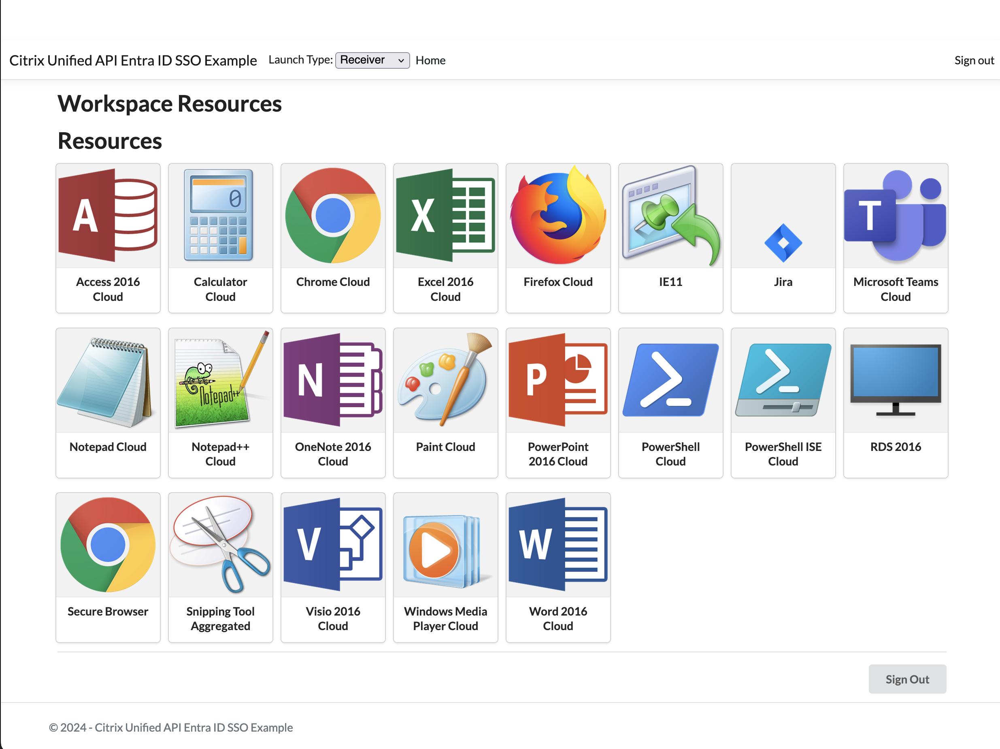
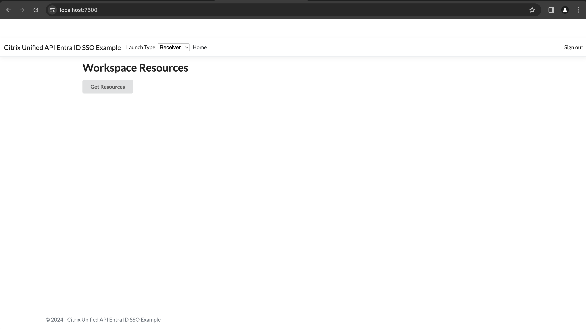
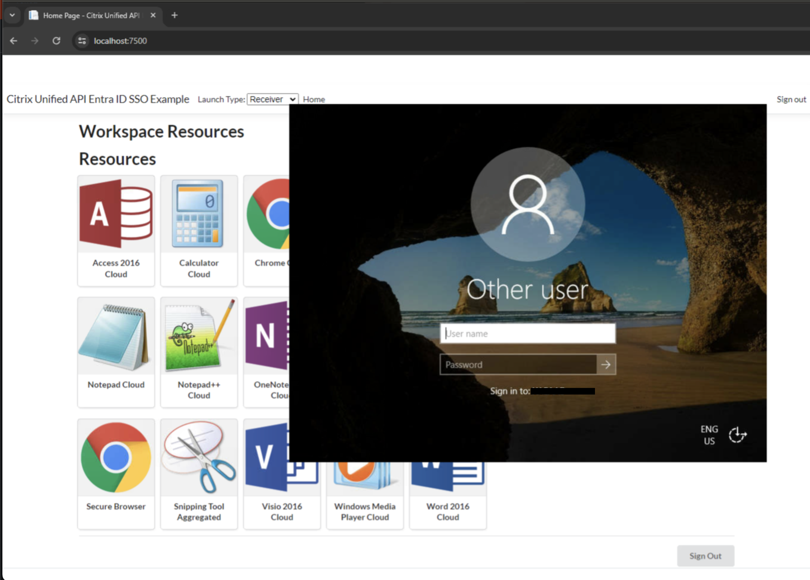
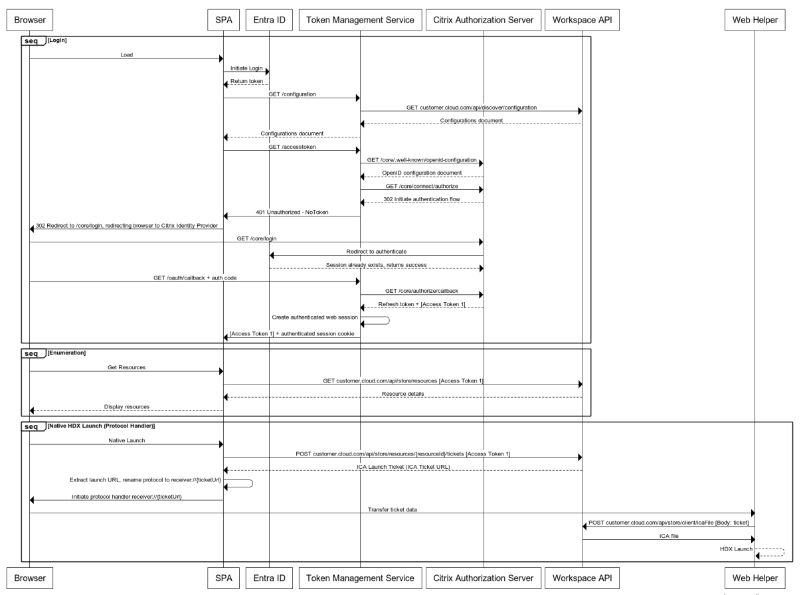
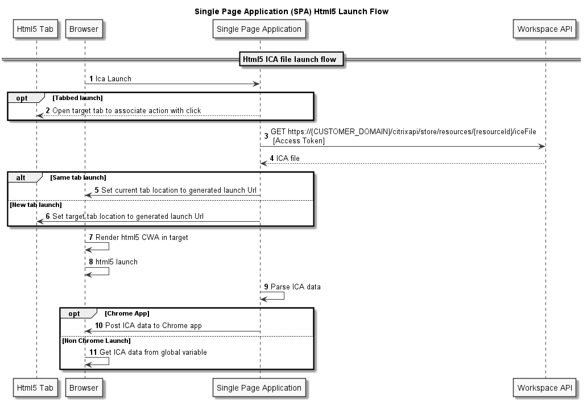

# Citrix(R) Unified Workspace API - Single Page Application (SPA) Single Sign-On sample built with .Net Core and Javascript

A sample Single Page Application that shows how to interact with Unified Workspace APIs using Entra ID, using Single Sign-On to get a Unified Workspace API access token after an initial Entra ID logon. It is a pure JavaScript implementation that is hosted by a C# ASP .NET server.

For this sample to work, you will need to be using Azure AD / Entra ID as your identity provider.

It uses the provided sample Token Management Service ([TMS](./Citrix.UnifiedApi.Test.TMS/README.md)) as its backend to handle OAuth tokens, and once it's received a token it will call the Workspace APIs to get resources and perform launches.

This is purely an example and shouldn't be used for real production services.

## Sample site preview



## Prerequisites

- You have either a Private or Public Workspace OAuth Client
- You will be running the example code in Visual Studio and can run [.NET 8.0](https://dotnet.microsoft.com/en-us/download/dotnet/8.0)
- You have the [Citrix Workspace App](https://www.citrix.com/downloads/workspace-app/windows/workspace-app-for-windows-latest.html) installed

## Getting Started

### Run the provided sample Token Management Service (TMS)

To run this example, you must first be running the TMS. See the instructions [here](./Citrix.UnifiedApi.Test.TMS/README.md).

You will need to configure the TMS Frontend settings in the [`appsettings.Development.json`](./Citrix.UnifiedApi.Test.TMS/Citrix.UnifiedApi.Test.TMS/appsettings.Development.json) file as follows:

```json
"FrontEnd": {
    "FrontEndRedirectUrl": "https://localhost:7500/",
    "FrontEndCorsOrigin": "https://localhost:7500/"
}
```

This is because the Entra ID SSO SPA is configured to run on `https://localhost:7500`.

### SPA

The SPA code assumes that you are running the TMS on `https://localhost:7182`. If you're running the TMS on a different host, update the "TokenManagementBaseUri" field in [appsettings.json](./Citrix.UnifiedApi.Test.SPA.AAD/appsettings.json) to the correct value.

## Running the example

First, ensure the Token Management Service is configured correctly. See the [README](Citrix.UnifiedApi.Test.TMS/README.md) to find out how to do this.

The C# server provides the backend and hosts the HTML and JavaScript files, and also provides endpoints for performing authorization. See the [Token Management Service](../Citrix.UnifiedApi.Test.TMS/README.md) for details on how the flow occurs.

You will need to have an app registration configured in Entra ID, with a configured client secret. To work with this sample, the app registration will require `https://localhost:7500/signin-oidc` to be configured as a Web Redirect URI, and `https://localhost:7500/signout-oidc` to be configured as the front-channel logout URL.

In the [`appsettings.json`](Citrix.UnifiedApi.Test.SPA.AAD/appsettings.json) file, you will need to set the `CustomerDomain` field to your Citrix domain, and the `ApplicationId` field to the application ID for the OAuth client you have created in the Citrix Cloud Admin Console.

You will also need to change the required fields in the `AzureAd` section in the [`appsettings.json`](Citrix.UnifiedApi.Test.SPA.AAD/appsettings.json) file to configure the example to talk to your Entra ID setup. The values to use can be found in the App Registration for your app in the Entra ID section in the Azure Portal.

- Domain - the name of your domain in Entra ID
- Tenant ID - The ID of the tenant your app registration is in. Shown on the overview page for the app registration as "Directory (tenant) ID"
- Client ID - The ID of your app registration. Shown on the overview page as "Application (client) ID"
- Client Secret - The secret of your app registration. Shown on the "Certificates & secrets" tab of your app registration's details page.
  
We recommend using an incognito/private browser window when using this sample to avoid cookies and caching causing problems.

Once started, you should be immediately redirected to an Entra ID login for your application. After logging into your application, you should be taken to the home page.



Clicking the "Get Resources" button will initiate a request with the TMS to obtain a token to use to talk to the Unified API services, before then performing an enumeration of resources. As you have already logged in via Entra ID, this process will not require further authentication - the authentication process will redirect to Entra ID, which recognises the existing session and passes the authentication check.

After these steps, the page should display your resources, like in the image below.


Clicking on the resources should initiate a launch, which will be handled by the installed Citrix Workspace App by default.



## SPA and Token Management Service Sequence Diagram

This sequence diagram illustrates the API calls the example Single Page Application (SPA) and the Token Management Service (TMS) will make during the initial page load, login, resource enumeration and resource launch, including the single sign-on interaction with Entra ID.



## Javascript

The SPA frontend implementation uses simple JavaScript without any framework. For a more complicated application, implementers may want to consider using a framework such as Angular or React (see https://learn.microsoft.com/en-us/aspnet/core/client-side/spa/angular and https://learn.microsoft.com/en-us/aspnet/core/client-side/spa/react for information on integrating these frameworks with ASP.NET). This will also allow for proper package management of the JavaScript libraries.

The implementation retrieves the access token and stores it inside a private JavaScript closure. There are more secure alternatives involving web worker threads, or to simply have all token calls be handled by the backend (as in the [Citrix.Unified.Api.Test.WebClient](https://github.com/citrix/citrix-unified-workspace-api-web-example) example).

## Resource launches
This example supports three types of launch: native (using the Citrix Workspace App), HTML5, and IFrame.

### Native launches
Native launches work by calling the native Citrix Workspace App with a launch ticket that can obtained from the `launchstatus` endpoint on a resource. This response contains the URL to redirect the user to.

### HTML5 and IFrame launches
HTML5 and IFrame launches work similarly to each other. These launch methods make use of the Citrix HTML5 HDX SDK. This SDK uses the ICA file which contains information about how a connection should be established. An ICA file can be obtained from the `launchica` endpoint on a resource.



Source code to launch a resource in a new tab. For more information check the [SDK documentation](https://developer-docs.citrix.com/en-us/citrix-workspace-app-for-html5/workspace-app-html5-hdx-sdx/hdx-sdk-html5)
```js
citrix.receiver.setPath("https://localhost:7500/receiver"); 
let icaFile = await apiHandler.get(launchUrl)
const sessionId = "html5"
const connectionParams = {
    "launchType": "newtab",
    "container": {
        "type": "window"
    }
};

function sessionCreated(sessionObject){
    const launchData = {"type": "ini", value: icaFile.data};
    sessionObject.start(launchData);
}
citrix.receiver.createSession(sessionId, connectionParams,sessionCreated);
```

## Attributions

The repo includes the following NuGet packages:

- Microsoft.Identity.Web, https://www.nuget.org/packages/Microsoft.Identity.Web

The repo includes the following JavaScript libraries:

- Axios, https://axios-http.com/
- Handlebars, https://handlebarsjs.com/
- jQuery,  https://jquery.com/
- Semantic UI CSS, https://semantic-ui.com/
- Citrix HTML5 HDX SDK, https://developer-docs.citrix.com/en-us/citrix-workspace-app-for-html5/workspace-app-html5-hdx-sdx/hdx-sdk-html5

## License

This project is licensed under the MIT license. The text can be found in the [LICENSE file](./LICENSE).

Copyright © 2024. Cloud Software Group, Inc. All Rights Reserved.
